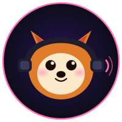

<div align="center">
  

  <h1>ShimaTTS</h1>
  <p><strong>Local Twitch TTS alerts with AI voice cloning - no cloud, no subscriptions</strong></p>

  [](https://python.org)
  [](#installation)
  [](https://twitch.tv)
  [](https://obsproject.com)
  [](#requirements)
  [](LICENSE)

</div>

---

Channel point redeems trigger an AI TTS alert in OBS. Your viewer types a message, ShimaTTS speaks it in a cloned voice as "[username] says [message]", and an animated alert banner appears on stream with your GIF, the viewer's name, and their message. Runs entirely on your machine using F5-TTS on your GPU.

## Features

- **AI Voice Cloning** - Clone any voice from a 10-30 second audio sample (F5-TTS, runs on your GPU)
- **One-Click Twitch Login** - No tokens to copy, no developer setup; channel name auto-fills
- **Animated OBS Overlay** - Themed alert banner with your GIF + viewer name + message, auto-fits any message length
- **Native App Window** - Cute shiba-themed dashboard with light/dark mode, no browser tabs needed
- **Voice & GIF Libraries** - Upload, preview (built-in audio player / live GIF previews), and switch with a click
- **Test & Preview** - See your alert in-app and fire real test alerts into OBS without spending channel points
- **Custom Prefix** - Control how messages are spoken: `{username} says {message}` or anything you like
- **Content Filtering** - Built-in slur blocklist, word-count cap, and your own custom blocked words
- **TTS Queue** - Multiple redemptions play one at a time, no audio overlap
- **System Tray** - Close the window and it keeps running quietly with live connection status

## Requirements

- Windows 10 / 11
- Nvidia GPU with CUDA strongly recommended (8GB+ VRAM, tested on RTX 3060) - runs on CPU without one, but generation is much slower
- [OBS Studio](https://obsproject.com)
- ~12GB free disk space (Python runtime, CUDA PyTorch and the F5-TTS model, installed on first run)

## Installation

1. Grab the latest `ShimaTTS.zip` from [Releases](https://github.com/JiroDavid/ShimaTTS/releases)
2. Extract it anywhere (e.g. `C:\ShimaTTS\`)
3. Run `ShimaTTS.exe` - a one-time setup window installs the AI runtime (several GB, GPU build picked automatically)
4. The ShimaTTS window opens - click **Login with Twitch**, upload a voice sample and GIF, click **Save & Start**
5. The F5-TTS model downloads automatically on first start (~1GB, one time only)

> First launch takes a while (runtime + model download). After that, startup is ~30 seconds. Closing the window keeps ShimaTTS running in the system tray; quit from the tray menu or the Quit button in the app.

## OBS Setup

This is the only manual step - takes about 30 seconds:

1. In OBS, add a **Browser Source** to your scene
2. URL: `http://localhost:7878/overlay`
3. Width `1260`, Height `260` - the alert fills the source exactly, so drag it wherever you want the alert to appear (a tall source like `260` x `1260` switches to a vertical layout automatically)
4. Enable **Refresh browser when scene becomes active**
5. Leave background transparent (default)

The source stays fully transparent between alerts. Use the **Test & Preview** section in the app to fire test alerts while you position it - no channel points needed.

## Voice Sample Tips

| | Recommendation |
|---|---|
| **Length** | 10-30 seconds |
| **Format** | WAV or MP3 |
| **Content** | Clear speech, no background music or reverb |
| **Transcript** | Optional - auto-detected. For best quality, set `voice_sample_text` in `config.json` to the exact words spoken |
| **Mic distance** | Close-mic for best clone quality |

## Configuration

Settings are saved in `config.json` next to the exe. You can edit it directly or reopen the app window from the system tray. Twitch auth is one click: **Login with Twitch** opens the official Twitch authorization page and the token lands in the app automatically - no token generators, no copy-pasting.

| Key | Description | Default |
|---|---|---|
| `twitch_token` | OAuth token (filled by Login with Twitch) | - |
| `twitch_client_id` | Only needed if you registered your own Twitch app | built-in |
| `channel_name` | Your Twitch username (auto-filled after login) | - |
| `reward_name` | Exact name of the channel point reward to watch | - |
| `voice_sample` | Path to your voice sample file (WAV/MP3) | - |
| `voice_sample_text` | Exact words spoken in the voice sample (improves quality) | - |
| `overlay_gif` | Path to the GIF shown in the alert | - |
| `tts_template` | How messages are spoken, e.g. `Message from {username}: {message}` | `{username} says {message}` |
| `max_message_words` | Max words before a message is dropped | `20` |
| `blocked_words` | Extra words that skip a message (managed in the app) | `[]` |
| `port` | Local server port (config.json only, not exposed in the UI) | `7878` |

Voice samples and GIFs uploaded through the app are stored in the `data/` folder next to the exe and can be previewed, switched, and deleted from the **File Library** section in the app.

## Testing

The easiest way: the **Test & Preview** section in the app shows your alert live and sends real test alerts to OBS. For deeper checks there are also command-line flags:

**Test TTS generation**
```
ShimaTTS.exe --test-tts "Hello chat, this is a test message"
```
Generates audio and plays it immediately. No Twitch connection needed.

**Test the overlay**
```
ShimaTTS.exe --test-overlay
```
Fires a fake redemption alert in OBS so you can check positioning and timing without touching your channel points.

**Test Twitch connection**
```
ShimaTTS.exe --test-twitch
```
Connects to EventSub and prints incoming redemption events to console without generating TTS - useful for confirming your reward name is correct.

## vs. Other TTS Tools

| | ShimaTTS | StreamElements TTS | ElevenLabs | Amazon Polly |
|---|:---:|:---:|:---:|:---:|
| **Voice cloning** | Yes | No | Yes (paid) | No |
| **Runs locally** | Yes | No | No | No |
| **Cost** | Free | Free | $5-$99/mo | Pay-per-use |
| **Privacy** | Full - no data leaves your PC | Messages sent to cloud | Messages sent to cloud | Messages sent to cloud |
| **Custom GIF overlay** | Yes | Limited | No | No |
| **Latency** | ~2-5s (GPU) | ~0.5s | ~1-2s | ~0.5s |
| **Voice quality** | High (F5-TTS) | Robotic | Very High | Good |
| **Channel points native** | Yes | Yes | No | No |
| **Setup difficulty** | One-time download | Instant | API key | API key |

ShimaTTS trades a slightly higher first-run setup cost for complete privacy, zero ongoing cost, and a voice that actually sounds like someone you chose.

## Development

Built in WSL, tested on Windows. See [docs/dev-workflow.md](docs/dev-workflow.md) for the edit-test loop, and [docs/design.md](docs/design.md) for architecture. The distribution is a small frozen launcher that provisions a private Python environment with [uv](https://github.com/astral-sh/uv) on first run - the app itself ships as source, so there is no PyInstaller import whack-a-mole and CUDA torch fits despite GitHub's 2 GB release limit.

## License

MIT - do whatever you want with it.
